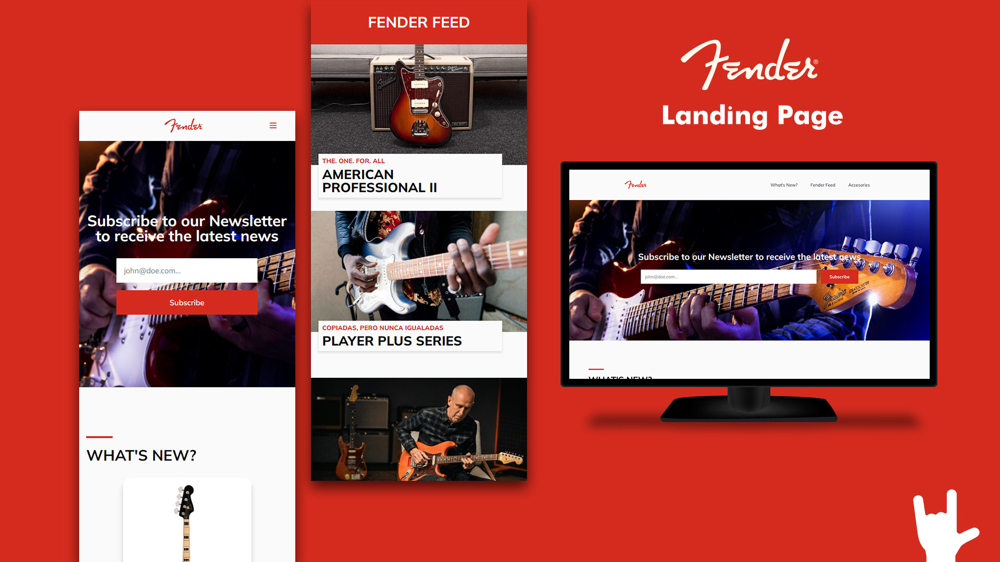

# Lading page inspired by Fender

Hi! 👋🏻 This web was originally a project for [freeCodeCamp](https://freecodecamp.org/) Responsive Web Design Course, some time ago. Now that I'm learning React I thought it'd be nice to add it into this project for practice.
The web is not exactly a clone of the original Fender website, but rather it server as inspiration for my back in the day, and was useful to practice since it has many components that can be reusable.

Overall I'm very happy with the result though I see some things that could be improved.

## Technologies used

## Links

- Visit the [website demo](https://malconh.github.io/fender-landing-page/)
- Check my [LinkedIn profile](https://linkedin.com/in/malcon-heltner/)
